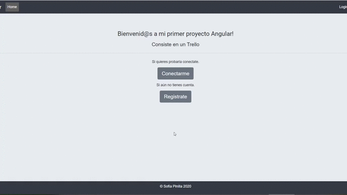
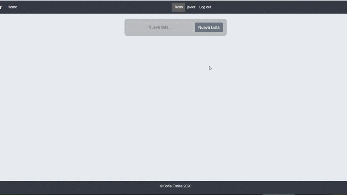
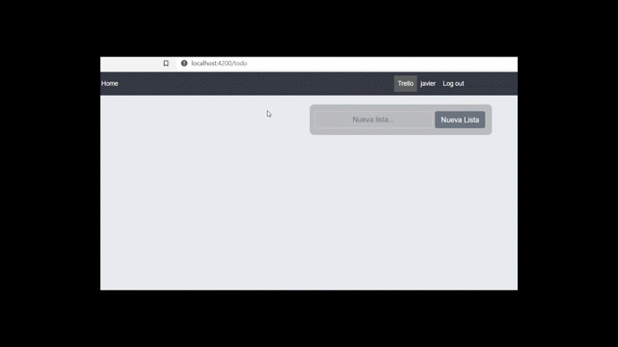
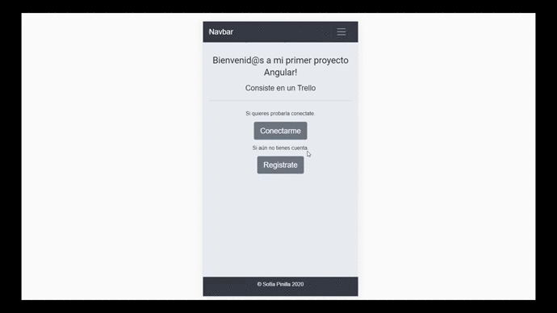

# Task-app-angular
Este proyecto es una pagina web , en la cual puedes buscar reguistrarte, conectarte, y continuación poder disfrutar de un trello.

## Tecnologías que he utilizado 🛠️

>Mi proyecto esta creado con Angular(HTML5 , CSS3,Layout( Flex ),Bootstrap, Responsive Design), en el frontend. Y con Node, Express, JWT, Bcrypt, Sequelize y Mysql Workbench en el backend.

 ---

#### Preview

 


 


 

Aquí se puede apreciar que la pagina es responsive.

 

---

### Instalación 🔧

Para poder iniciar el proyecto primero haz un clone:

```
git clone https://github.com/SofiaPinilla/task-app-angular.git
```
# Backend

Una vez clonado el proyecto, debes instalar los modulos necesarios con npm:
```
npm i express JWT Bcrypt sequelize axios mysql2
```

Ya esta listo el proyecto, ahora para iniciarlo debes levantar el backend con node:

```
cd backend
```

```
node app
```

Y levantar el frontend con live server o iniciar tu index.html.

---


# Frontend

This project was generated with [Angular CLI](https://github.com/angular/angular-cli) version 9.0.7.

## Development server

Run `ng serve` for a dev server. Navigate to `http://localhost:4200/`. The app will automatically reload if you change any of the source files.

## Code scaffolding

Run `ng generate component component-name` to generate a new component. You can also use `ng generate directive|pipe|service|class|guard|interface|enum|module`.

## Build

Run `ng build` to build the project. The build artifacts will be stored in the `dist/` directory. Use the `--prod` flag for a production build.

## Running unit tests

Run `ng test` to execute the unit tests via [Karma](https://karma-runner.github.io).

## Running end-to-end tests

Run `ng e2e` to execute the end-to-end tests via [Protractor](http://www.protractortest.org/).

## Further help

To get more help on the Angular CLI use `ng help` or go check out the [Angular CLI README](https://github.com/angular/angular-cli/blob/master/README.md).


Hecho por [Sofía Pinilla](https://github.com/SofiaPinilla) 😊
